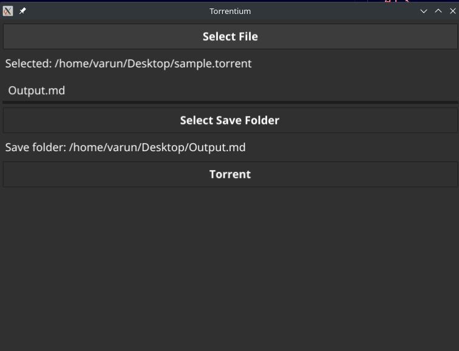

# Torrentium : A BitTorrent Client

**Torrentium** is go based BitTorrent client that can be used to download files using torrent files.

<!--[ ]:Add picture of UI-->



## Features

- uses the BitTorent protocol to download files from multiple peers
- uses go routines to download files parallely from multiple peers
- uses Mutex locks in go to manage access to shared memory used while downloading
- uses fyne framework to provide a UI to user.

## Setup

- clone the repo using the following command

```[git]
git clone https://github.com/20Varun23/TorClient.git
```

- from the root directory run the following command and the UI will appear

```[git]
go run mango.go
```

- From here you can select the .torrent file (a sample file is given in the project for testing purposes and select "run")
